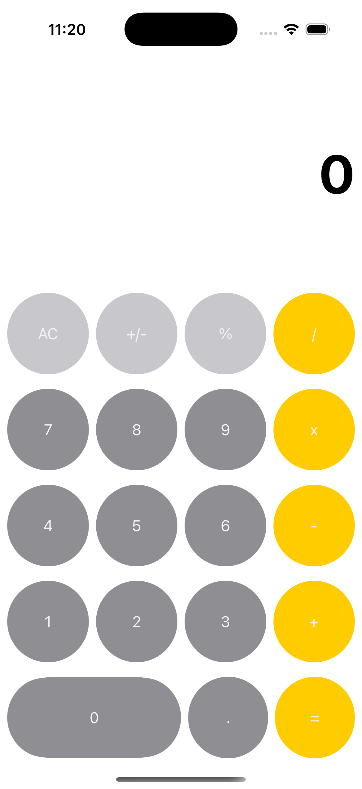

# 🧮 Basic Calculator

**Basic Calculator** is a simple iOS app built entirely with **UIKit programmatic UI**, designed to perform basic arithmetic operations: addition, subtraction, multiplication, and division.

This app was created as a learning exercise to understand layout, views, and event handling in UIKit without using Storyboards.

---

## 📱 Features

- ➕ Addition
- ➖ Subtraction
- ✖️ Multiplication
- ➗ Division
- 🧩 Built 100% with programmatic UIKit

---

## 🧰 Technologies

- **Swift**
- **UIKit (Programmatic UI)**

---

## 🖼 Preview

<p align="center">
  
</p>

> 📸 *Preview of the calculator interface.*

---

## 🚀 Getting Started

1. Clone the repository:
   ```bash
   git clone https://github.com/yisslu/BasicCalculator.git
2. Open the project in XCode:
   ```bash
   open BasiCalculator.xcodeproj
3. Run on simulator or real device.
